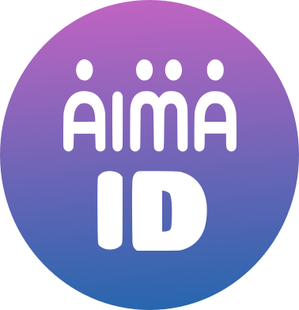
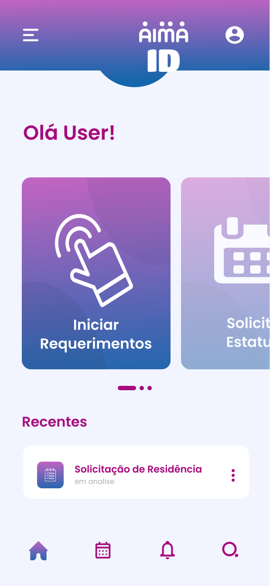
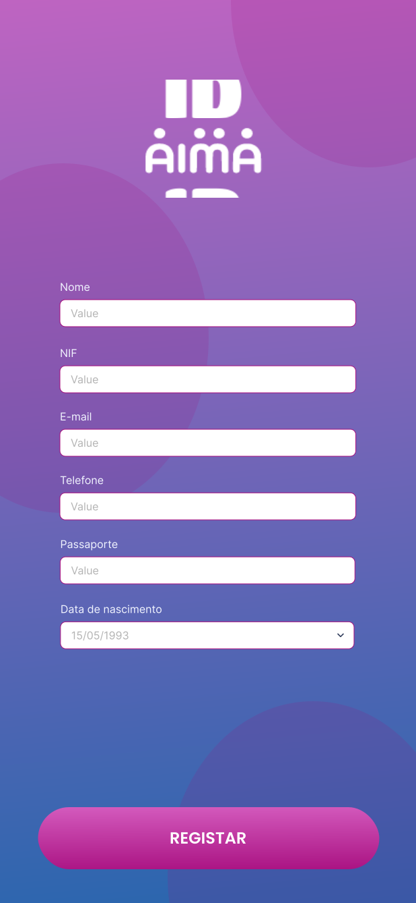
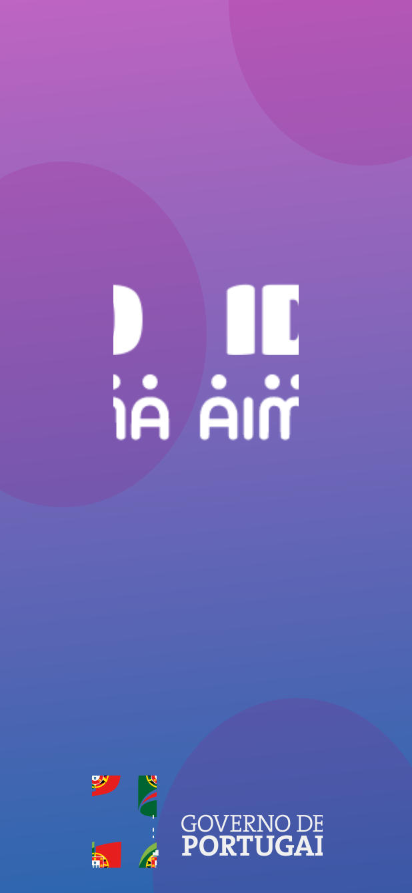

<h3 align="center">AIMA ID App</h3>

 

  

  

    A comprehensive app to navigate Portugal's immigration and asylum services, managed by AIMA.
     
     
    

## About The Project

This project was developed by **The DuckTeam** 🦆:
[Pris-c](https://github.com/Pris-c), [Arthur](https://github.com/ArthurSSR-alt), [Thais](https://github.com/thaisfreires), e [Gabriel](https://github.com/gabrielbeli).
 

The **AIMA ID App** is designed to help users easily navigate immigration and asylum services in Portugal, managed by the new Agency for Integration, Migration, and Asylum (AIMA). Established in 2023 to replace SEF, AIMA handles a range of processes for immigrants and asylum seekers, focusing on integration, family reunification, and streamlined document management. By transferring enforcement duties to the Public Security Police (PSP) and Judiciary Police (PJ), AIMA’s services concentrate on ensuring accessible, efficient services for foreign nationals in Portugal.

  
  
  

### Key Features

- **Role-Based Access**:
    - **Staff**: Manages applications, verifies documents, and assists applicants.
    - **Admin**: Oversees staff and service users, manages permissions, and handles system settings.
    - **Service User**: Submits applications, tracks status, uploads documents, and communicates with staff.

- **Residence Permit Management**:
    - Issue and renew residence permits for foreign nationals residing in Portugal, including family reunification and investment-related permits.

- **Family Reunification**:
    - Facilitate the reunification of immigrants with their families under international agreements.

- **Digital Registration**:
    - Allows users to register via the official AIMA website or the SAPA portal, with easy account creation and document submission.

- **Document Requirements and Verification**:
    - Provides a comprehensive list of mandatory and optional documents for different processes, streamlining document verification and reducing application delays.

- **Visa Extension and Renewal**:
    - Extend or renew visas with clear guidelines on required documents for each type.

### Built With
* 
* 
* 

## Getting Started

To access AIMA’s digital services, follow these steps:

### Pre-requisites

- **Android Studio** installed (latest version recommended)
- **Java Development Kit (JDK)** installed (version 8 or above)
- A device or emulator to run the app

### Installation

1. **Open the Project**:
    - Launch Android Studio.
    - Select **Open an existing Android Studio project** and choose the AIMA ID App folder.

2. **Build the Project**:
    - Click on **Build** > **Make Project**.

3. **Run the App**:
    - Connect your Android device (enable USB Debugging) or choose an emulator.
    - Click the **Run** button (green triangle) in Android Studio to install the app.

### Manual APK Installation (if needed)
1. Build the APK via **Build** > **Build Bundle(s) / APK(s)** > **Build APK(s)**.
2. Transfer the APK to your device.
3. Enable **Unknown Sources** in device settings.
4. Tap the APK file to install.

---

✨**This project was developed as a learning resource for the Software Developer Course at Cesae Digital.**